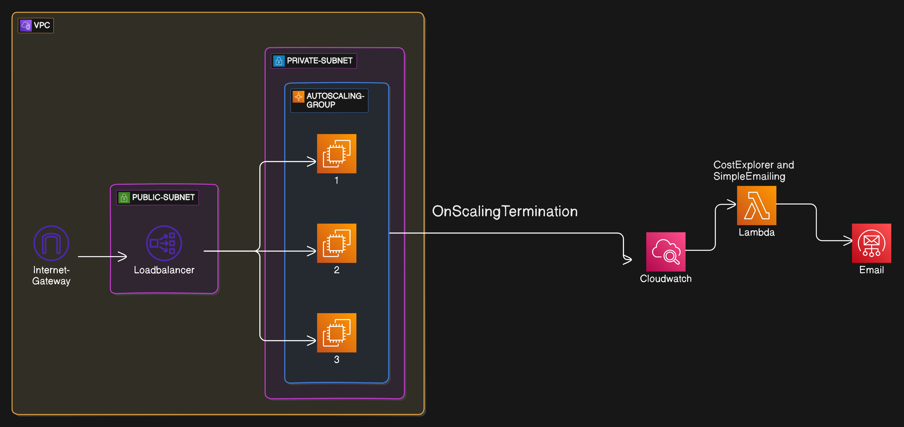

# Important Note
This project is still in development , may contain some bugs and issues
# Nearfield Instruments Assignment
A simple demonstration of the interview assignment by nearfield instruments.
The whole project is created using Terraform and some Python for Lambda.
Here is what the final infrastructure should look like. you can tune the parameters for each module in `main.tf` file 


Whole Infrastructure is divided into 3 seprated modules.
# VPC
VPC module is responsible for setting up a basic VPC in AWS including\
VPC itself,public and private subnets,routing table, internet gateway and 
loadbalancer.

# Scaling
Scaling module is responsible for setting the Autoscaling group and template required for spinning up the EC2 instances. 
scaling has 3 main parameters\
1. Min Size: for minimum size of the EC2 instances
2. Max Size: for maximum size of the EC2 instances
3. Desired Size: the initial size that we want to maintain during the hours
## Scaling recurrence
The recurrence is the scheduling we want the scaling to happen. The time is in `cron` format and parameters are:
1. recurrence up: the time that the scaling up happens.
2. recurrence down: the time that scaling in happens.
## Scaling in event
After the scaling in happens and all the EC2 instances return to minimum size (in our case it's 0), an event called `EC2 Instance Terminate Successful` happens. after emitting the event to cloudwatch the Notification phase will happen.
[find out more on autoscaling events](https://docs.aws.amazon.com/autoscaling/ec2/userguide/ec2-auto-scaling-event-reference.html)

# Notifcation
The third and final module is notification module. It consists of 2 parts
1. Cloudwatch: responsible for capturing the ASG events.
2. Finance Report: simple script that runs in Lambda.

After emitting the event from ASG, the cloud watch will capture the event and spins up a `Lambda` VM and runs the script.\
the main part of notif module is `finance_report.py` python script that does the logic of getting the billing report , parsing it and emailing it to recipients.
## Finance Report
A simple Python script that uses `boto3` (AWS API client for python). We use 2 seprate clients brought by `boto3` to get the logic implemented.
1. Cost Explorer Client: A set of APIs for getting some financial reports.
2. SESv2 Client: A client for sending out email and bulk emails to recipients

There are 3 most important parameters that should be passed to notification module:\
1. Recipients: A list of email addresses seperated by `;` that `finance_report` should send the email to
2. Source Email: The source of the email that came from (on production you can set it to `devops@nearfield-instruments.com`)
3. Granularity: Is the shortest unit of time that billing should be grouped by. possible values are `HOURLY`,`DAILY`,`MONTHLY`\
NOTE: For `HOURLY` granularity , the account must have some features to be activated. It's more like a premium feature. [More Info](https://docs.aws.amazon.com/cost-management/latest/userguide/ce-exploring-data.html)
### Running the finance report localy
you can test the finance report locally on your PC. if you have sufficient priviliges you will see the output on the terminal by running
```bash
REPORT_GRANULARITY="DAILY" python3 modules/notification/finance_report/finance_reporty.py --dry-run
```
The output is a simple `number USD` which shows the amount of billing for the day that script was run.
